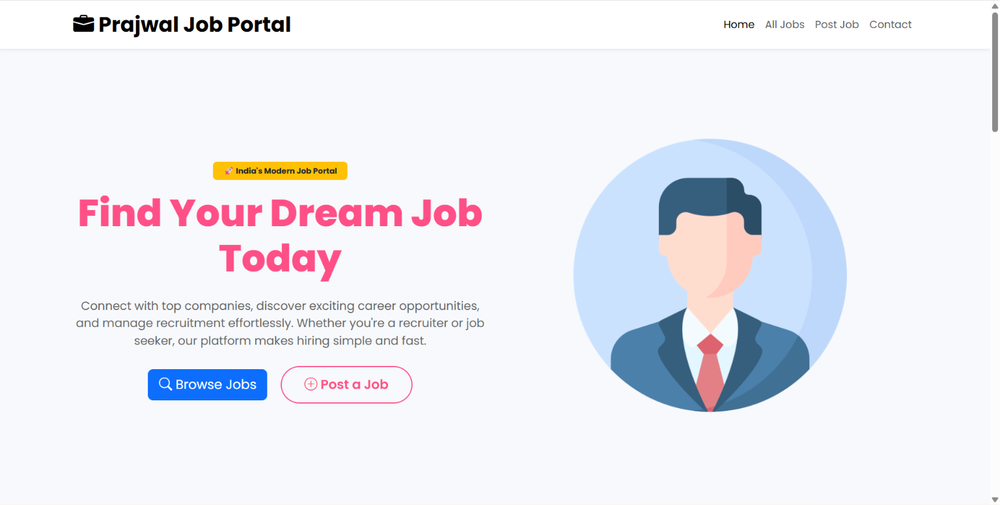
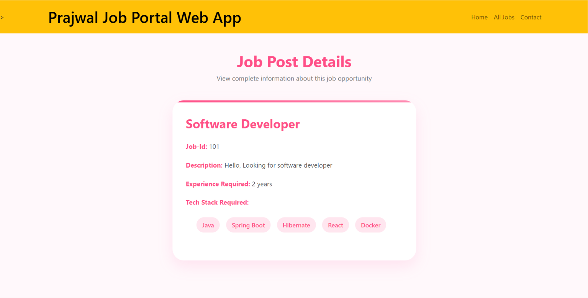
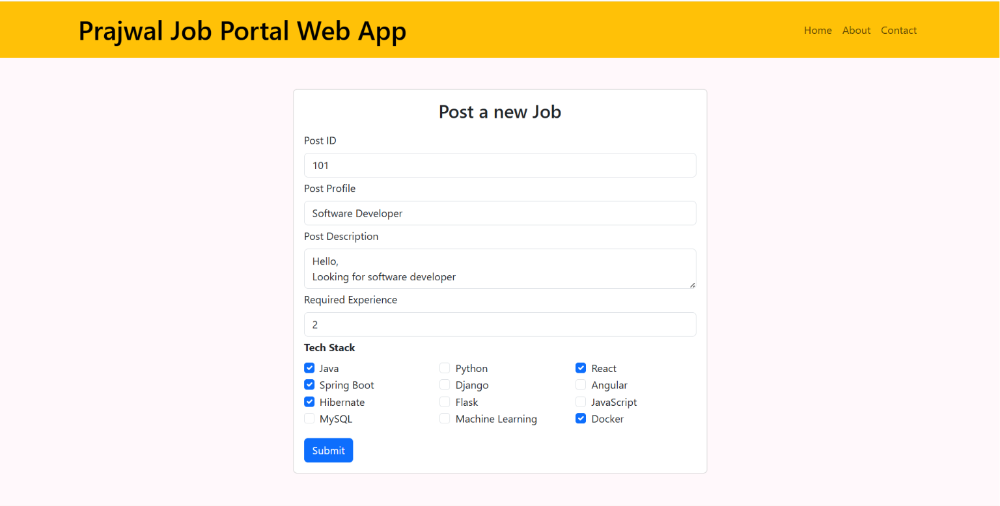
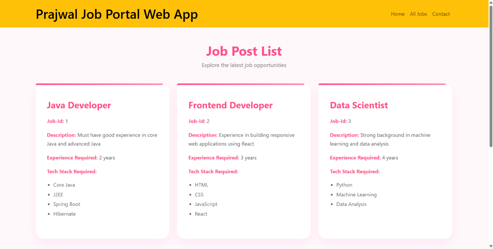

# 💼 Job Portal Web Application


A modern and responsive **Job Portal Web Application** built using **Java, Spring Boot, JSP, Maven, and Embedded Tomcat** following the MVC architecture.

The application enables users to browse job opportunities, post new jobs, and view detailed job information through a clean and responsive user interface.

---

# 🌐 Live Demo

### 🚀 https://job-portal-spring-boot-jsp.onrender.com/

---

# 📂 GitHub Repository

### https://github.com/prajwalkarajange/job-portal-spring-boot-jsp

---

# ✨ Features

- 🏠 Beautiful Landing Page
- 💼 Browse Available Jobs
- ➕ Post New Jobs
- 📄 View Job Details
- 🎨 Responsive UI
- 📱 Mobile Friendly
- ⚡ Spring Boot MVC Architecture
- 🧩 JSP View Engine
- 📦 Maven Project
- 🚀 Live Deployment on Render
- 💡 Clean Layered Architecture

---

# 📸 Application Screenshots

| Home Page | Job Listings |
|-----------|--------------|
|  |  |

| Post Job | Job Details |
|----------|-------------|
|  |  |

---

# 🛠️ Tech Stack

### Backend

- Java 21
- Spring Boot 3
- Spring MVC

### Frontend

- JSP
- HTML5
- CSS3
- Bootstrap 5
- JavaScript

### Build Tool

- Maven

### Server

- Embedded Apache Tomcat

### Deployment

- Render

---

# 🏗️ Project Architecture

```
Browser
     │
     ▼
JSP Views
     │
     ▼
Spring MVC Controller
     │
     ▼
Service Layer
     │
     ▼
Repository Layer
     │
     ▼
In-Memory Data Storage (ArrayList)
```

---

# 📁 Project Structure

```
job-portal-spring-boot-jsp
│
├── images
│   ├── home.png
│   ├── jobs.png
│   ├── add-job.png
│   └── details.png
│
├── src
│   └── main
│       ├── java
│       │   ├── controller
│       │   ├── model
│       │   ├── repository
│       │   ├── service
│       │   └── JobAppApplication.java
│       │
│       ├── resources
│       │   └── application.properties
│       │
│       └── webapp
│           └── views
│
├── Dockerfile
├── pom.xml
├── mvnw
├── mvnw.cmd
└── README.md
```

---

# ⚙️ Installation & Setup

## Clone the Repository

```bash
git clone https://github.com/prajwalkarajange/job-portal-spring-boot-jsp.git
```

## Navigate to Project

```bash
cd job-portal-spring-boot-jsp
```

## Build the Project

```bash
mvn clean install
```

## Run the Application

```bash
mvn spring-boot:run
```

Open your browser:

```
http://localhost:8080
```

---

# 📌 Modules

- 🏠 Home Page
- 💼 View All Jobs
- ➕ Add Job
- 📄 Job Details

---

# 📚 Key Concepts Used

- Spring Boot
- Spring MVC
- JSP
- JSTL
- Maven
- MVC Architecture
- Dependency Injection
- Form Handling
- Java Collections Framework
- Embedded Tomcat
- Docker
- Render Deployment

---

# 🚀 Future Enhancements

- ✅ MySQL Database Integration
- ✅ Spring Data JPA
- ✅ CRUD Operations
- ✅ Search Jobs
- ✅ Edit & Delete Jobs
- ✅ User Authentication
- ✅ Admin Dashboard
- ✅ REST API
- ✅ Pagination
- ✅ Docker Compose
- ✅ CI/CD Pipeline

---

# 👨‍💻 Developer

**Prajwal Karajange**

🎓 B.Tech Information Technology

🚀 Google Student Ambassador 2026

💻 Java Backend Developer | Full Stack Developer

### Connect with Me

- **LinkedIn:** https://www.linkedin.com/in/prajwal-karajange/
- **GitHub:** https://github.com/prajwalkarajange

---

# ⭐ Show Your Support

If you found this project useful, please consider giving it a ⭐ on GitHub.

It motivates me to build and share more open-source projects.

---

## 📄 License

This project is licensed under the MIT License.

---

## 🙏 Thank You

Thank you for visiting this repository.

Happy Coding! 🚀